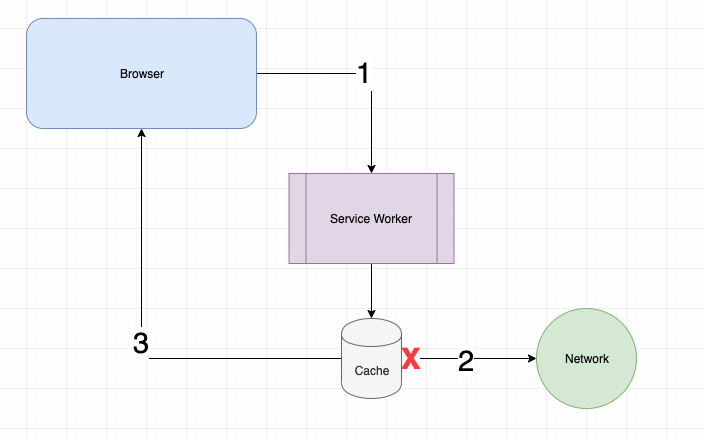

### Events:

- `install` event:

  - used to build the cache
  - `event.waitUntil` holds the sw in the install phase until all caches are built to prevent race condition

- `fetch` event:
  - the SW sits in between the site and network. It can intercept requests to the network & divert them to the cache. When this happens, the sw receives the fetch event
    
  - used to serve files from cache
  - `event.respondWith` waits for the innermost promise to resolve & returns its value